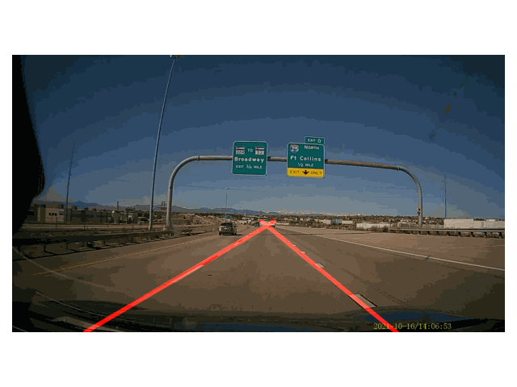

# lane_detectors
## Environment Setup
```shell
conda env create -n lane_detect python=3.6.5
conda activate lane_detect
conda install -c menpo opencv
conda install matplotlib
conda install pyqt
```
## How to Run the Programm
The following youtube clip is used for the demo
http://youtube.com/watch?v=U-9Yr_tCuu4

1. run the following command
```
INPUT_FILE=path_to_your_video # or to a image or a folder of images
SAVE=folder_to_save_the_detection_results
python main.py --input $INPUT_FILE --save_path $SAVE
```

2. click on the pop-up image to choose the vertices of a polygon enclosing the lanes (press "y" when finished)
<p align="center">
  
</p>
3. check if the determined polygon enclosed the lanes of interest (press "y" to run detection; press other keys to do selection again)
<p align="center">
  
</p> 
4. Then the detection would be running
<p align="center">
  
</p> 
